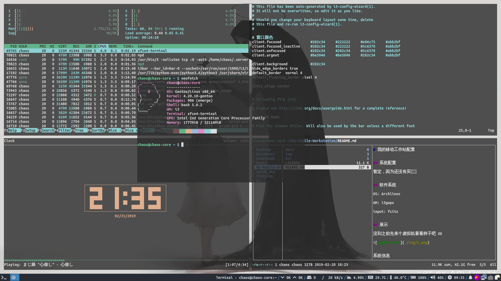
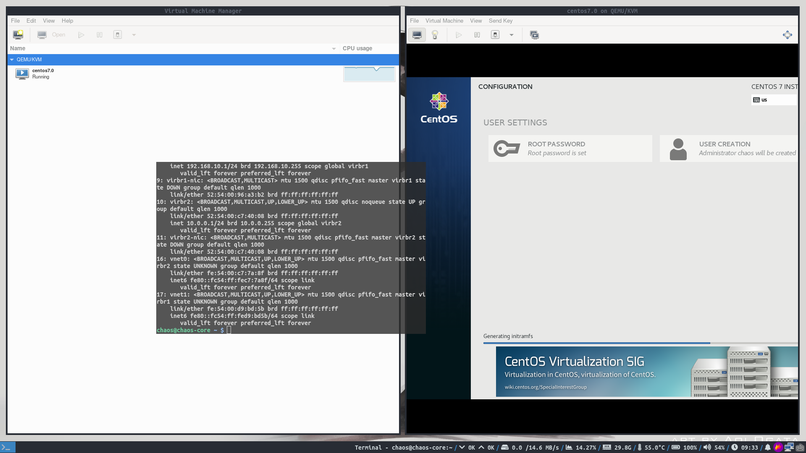

# 我的移动工作站配置

## 系统配置

ThinkPad W520 移动工作站

## 软件系统

OS: Gentoo Linux

WM: i3gaps

input: fcitx

Kernel: 4.20
## 截图

系统信息截图

KVM虚拟机截图

## 配置文件

配置文件已经包含了在这个项目中了

具体的配置可以看这个文档

[docs](./docs/install.md)
